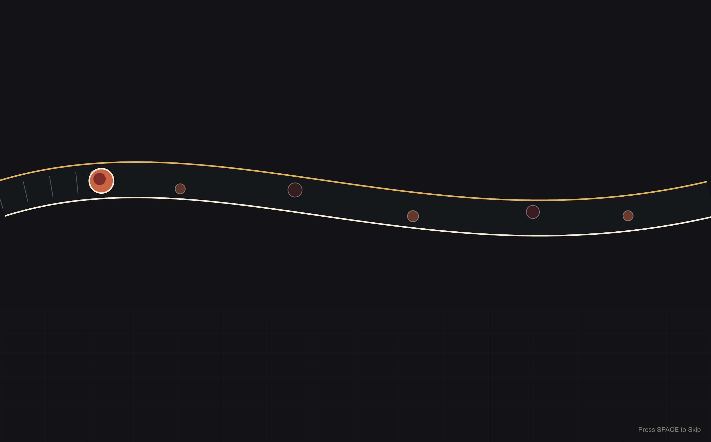

# Capillary Bolus Tracking & Gamma Curve Fitting Studio

[](https://github.com/mrozak4/Bolus_Tracking/releases/latest)
[](https://github.com/mrozak4/Bolus_Tracking/releases/latest)
[](https://github.com/mrozak4/Bolus_Tracking/releases/latest)


**[English](README.md) | [Français (Québec)](README_FR.md)**



### 1-Click Install
**macOS**:
1. Click the macOS download button above.
2. Download the `.dmg` file from the latest release.
3. Open the `.dmg` and drag the **Bolus Tracking Studio.app** to your Applications folder.

**Windows**:
1. Click the Windows download button above.
2. Download the `.exe` Setup file from the latest release.
3. Run the installer.

**Linux**:
1. Click the Linux download button above.
2. Download the `.AppImage` file from the latest release.
3. Make it executable (`chmod +x`) and run it.

---

Welcome to the **Capillary Bolus Tracking & Gamma Curve Fitting** repository. This project is a comprehensive suite of MATLAB, Python, and C++ tools designed to extract, analyze, and mathematically model fluorescent dye transit kinetics in brain capillaries for neurovascular coupling research.

---

## 1. Project Overview

During functional imaging experiments, boluses of fluorescent dye are injected into the vasculature. By tracking the Mean Fluorescence Intensity (MFI) within capillary Regions of Interest (ROIs), we can measure transit kinetics. 

This repository provides tools to:
1. **Denoise and Upsample** raw MFI time-series data.
2. **Estimate Timing Markers**: Automate the identification of bolus onset, peak amplitude, and transit end (first-pass clearance) using robust derivative-based heuristics.
3. **Fit Gamma Variate Functions**: Run two-pass robust curve fitting (Linear least-squares followed by Cauchy IRLS) to compute transit properties like Amplitude, Time to Peak ($T_{2p}$), Full Width at Half Maximum (FWHM), and Area Under the Curve (AUC).
4. **Compare Parity**: Match automated Python fits with legacy MATLAB output.
5. **Manually Edit Fits**: Interactively adjust fits using modern graphical user interfaces.

> [!TIP]
> **Preferred Pipeline**: While we maintain a reference Python solver, we highly recommend using the parallelized **C++ implementation** for cohort-scale batch processing. It executes **~11x faster** by parallelizing calculations across all CPU cores.

---

## 2. Directory and Sub-README Guide

We provide detailed documentation for each part of the codebase. Please refer to the files below depending on your workflow:

* **[RUNNING_GUIDE.md](docs/RUNNING_GUIDE.md)**: **Start Here.** A complete, beginner-friendly guide for setting up and running the parallel C++ batch pipeline and launching the interactive C++ GUI. Covers macOS, Linux, Windows, and Docker.
* **[INSTALL.md](docs/INSTALL.md)**: **Installation Instructions.** Setup, building, packaging, and installing the GUI application (including macOS app bundles and custom icons).
* **[PARITY_REPORT.md](docs/PARITY_REPORT.md)**: **Performance & Parity Report.** Compares Python vs. C++ implementation execution speeds, numerical outcomes, and provides recommendations.
* **[README_Python_Pipeline.md](docs/README_Python_Pipeline.md)**: **Python Reference Guide.** Details the Python implementation, custom loss functions (Cauchy robust weightings), Python GUI, local Python running instructions, and numerical optimization settings.
* **[README_BolusAnalysis.md](docs/README_BolusAnalysis.md)**: Standard overview of the bolus analysis workflow and math models.
* **[README_ApplyRegistrationToMask.md](docs/README_ApplyRegistrationToMask.md)**: Describes the MATLAB image registration script (`ApplyRegistrationToMask.m`) used to warp ROI masks to match moving spatial coords over time.

---

## 3. Codebase File Structure

### C++-Based Parallel & GUI Tools (Recommended)
* **`run_pipeline_cpp.sh`**: Command-line wrapper script that compiles and executes the parallel C++ pipeline inside Docker or locally.
* **C++ Pipeline Implementation Files**:
  * **`cpp/src/signal_processing.cpp`**: Spline upsampling, Gaussian smoothing, and outlier detection logic.
  * **`cpp/src/bolus_fitting.cpp`**: Levenberg-Marquardt non-linear curve fitting (via Eigen) and parameter heuristic auto-estimation.
  * **`cpp/src/roi_rasterizer.cpp`**: Polygon scanline rasterization for capillary ROI masks.
  * **`cpp/src/bolus_visualizer.cpp`**: SVG plotting functions and tick layout formatting.
  * **`cpp/src/dataset_processor.cpp`**: Image reading (via LibTIFF), detrending, and 3-pass quality control filtering.
  * **`cpp/src/batch_processor.cpp`**: Directory tree crawler, frame rate parsing, and dataset pairing logic.
  * **`cpp/src/main.cpp`**: Command-line execution entry point.
* **`cpp/include/bolus_tracking_cpp.hpp`**: Unified C++ header declaring all pipeline structures, parameters, and class interfaces.
* **`cpp/src/bolus_gui.cpp`**: ~~Cross-platform interactive C++ GUI built with Dear ImGui and ImPlot.~~ **DEPRECATED** — retained for reference. See `gui/` for the current GUI.
* **`cpp/tests/test_bolus_tracking_cpp.cpp`**: C++ test suite verifying all math routines, fit models, and edge cases.
* **`CMakeLists.txt`**: C++ build configuration file.
* **`Dockerfile.cpp`**: Docker configuration for compiling, testing, and containerizing the C++ pipeline.

### Electron GUI (Primary Interactive Tool)
* **`gui/`**: The **primary interactive GUI** for triage and quality control. Built on Electron (Chromium) with C++ SVG plot rendering and the MCM dark theme. See **[gui/README.md](gui/README.md)** for full documentation.

### Python-Based Reference Tools
* **`python/src/bolus_gui.py`**: ~~Interactive Python GUI.~~ **DEPRECATED** — retained for reference. Use the Electron GUI instead.
* **`run_pipeline.sh`**: Command-line wrapper script that sets up python virtual environments and executes the reference Python batch pipeline.
* **`python/src/batch_process.py`**: Scans folders for triplets (TIFF image, MAT mask, metadata TXT), extracts traces, runs fitting, and saves CSVs.
* **`python/src/bolus_tracking.py`**: Core mathematical algorithms containing filtering, upsampling, peak/onset/end detections, and curve fitting.
* **`python/tests/test_bolus_parity.py`**: Parity test suite verifying Python vs. MATLAB numerical outputs.

### MATLAB-Based Legacy Tools
* **`matlab/src/BolusTrack_InteractiveEdit.m`**: Interactive MATLAB GUI for visualizing and manually clicking bolus curves.
* **`matlab/src/gammaFun.m`**: Standard MATLAB implementation of the Gamma variate model.
* **`matlab/src/ApplyRegistrationToMask.m` & `matlab/src/GlobalShiftMask.m`**: Tools for aligning ROIs across registered images.
* **`matlab/src/calcFWHM.m`, `matlab/src/denoiseTrace.m`, `matlab/src/findMaskObjInData.m`, `matlab/src/parseFrameRateFromMetadata.m`**: Auxiliary MATLAB functions.

---

## 4. Quick Start Summary

For detailed instructions, see the **[RUNNING_GUIDE.md](docs/RUNNING_GUIDE.md)**.

### Run Automated Batch Pipeline (Preferred: C++ Parallel Solver)
To build and run the high-performance parallelized C++ pipeline via Docker:
```bash
bash run_pipeline_cpp.sh
```
This processes all subject datasets in parallel. To run the reference Python pipeline instead, run:
```bash
bash run_pipeline.sh
```

### Launch Interactive GUI (Electron — Recommended)
```bash
cd gui && npm install && npm start
```
This launches the Bolus Tracking Studio with the MCM dark theme, C++ SVG plots, splash screen animation, 44 languages, and full triage workflow. See **[gui/README.md](gui/README.md)** for details.

> [!NOTE]
> **Prerequisites**: Node.js ≥ 18 and a built `bolus_server` binary (run `cd build && cmake .. && make bolus_server`).

<details>
<summary>Legacy GUIs (Deprecated)</summary>

#### Legacy: C++ Dear ImGui GUI
```bash
mkdir -p build && cd build
cmake -DBUILD_GUI=ON ..
make -j4
./bolus_tracking_gui
```
> ⚠️ **Deprecated.** Requires GLFW, OpenGL, and native graphics libraries. Use the Electron GUI instead.

#### Legacy: Python tkinter GUI
```bash
.venv/bin/python python/src/bolus_gui.py
```
> ⚠️ **Deprecated.** Slower, no multi-language support, limited QC workflow. Use the Electron GUI instead.

</details>

---

## 5. Output Data Format

The batch pipelines output CSV files containing the following metrics for each capillary ROI:

| Column | Description |
| :--- | :--- |
| **ROI** | 1-indexed ID of the capillary Region of Interest. |
| **SubjNum** | Subject ID parsed from the data path. |
| **Exp** | Experiment condition name (e.g. `bolus1_baseline`). |
| **InitAmp** / **F_Amp** | Initial estimate and fitted peak amplitude of the bolus (in arbitrary Intensity **SU**). |
| **InitT2p** / **F_T2p** | Initial estimate and fitted Time-to-Peak (in **seconds**). |
| **InitFWHM** / **F_FWHM** | Initial estimate and fitted Full Width at Half Maximum (in **seconds**). |
| **InitM** / **F_M** | Initial estimate and fitted baseline mean value (in **SU**). |
| **InitSNR** / **F_SNR** | Baseline Signal-to-Noise Ratio ($\text{Baseline Mean} / \text{Baseline Noise SD}$). |
| **InitCNR** / **F_CNR** | Contrast-to-Noise Ratio ($\text{Bolus Amplitude} / \text{Baseline Noise SD}$). |
| **Click1_Start_T** | Time of the baseline start marker (in **seconds**). |
| **Click2_Onset_T** | Time of bolus onset (in **seconds**). |
| **Click3_Peak_T** | Time of the bolus peak (in **seconds**). |
| **Click4_End_T** | Time of first-pass clearance / end marker (in **seconds**). |
| **AUC** | Trapezoidal integration of the fitted bolus curve. |
| **AUCn** | Trapezoidal integration of the min-max normalized fitted bolus curve. |
| **TTlb** | Transit Time Lower Bound (95% CI lower limit of Time-to-Peak relative to Onset). |
| **TTm** | Peak Transit Time (Time-to-Peak relative to Onset). |
| **TThb** | Transit Time Higher Bound (95% CI upper limit of Time-to-Peak relative to Onset). |
| **OnT** | Onset Time (relative to fit window start, where normalized fit crosses 0.1). |
| **OnTSc** | Onset Time in Scan (relative to the earliest onset across all ROIs in the scan). |
| **ROISize** | Size of the Region of Interest mask (in pixels). |
| **Denoise_RMS** | Root Mean Square (RMS) of the noise removed during spline denoising (in **SU**). |
| **VesType** | Vessel type classification (`A` for Arteriole, `V` for Venule, `C` for Capillary, `U` for Unknown). |
| **QC_Flag** | Quality control flag (`PASS`, `WARN`, or `FAIL`). |
| **Fit_Source** | Origin of the fit parameters (`auto`, `population_prior`, or `manual`). |

---

## 6. Physiological Fit Parameter Constraints & Quality Control

To prevent non-physical fits (e.g. infinite/negative values, extremely slow bolus peaks, or amplitude levels exceeding hardware limits), the pipeline implements strict, physiologically informed parameter bounds and QC checks.

### Default Constraint Bounds:
* **Amplitude (`F_Amp`)**: Constrained between `1e-6` and `1023.0`. The upper bound of `1023.0` corresponds to the maximum dynamic range of the 10-bit microscope digitizer.
* **Time-to-Peak (`F_T2p`)**: Constrained between `1e-6` and the **duration of the fit window** (automatically computed from the onset to end of the trace segment). This ensures the peak is found within the actual scan window.
* **FWHM (`F_FWHM`)**: Constrained between `0.5` seconds and the **duration of the fit window**. The lower bound of `0.5` seconds represents the fastest physiologically plausible transit speed of dye through a capillary.
* **Baseline shift (`F_M`)**: Dynamically constrained based on the estimated baseline noise standard deviation to prevent optimizer divergence.

### Quality Control Triage Status (`QC_Flag`):
- **`PASS`**: The fit completed successfully, parameters did not land within 1% of absolute solver bounds, $F\_CNR > 5.0$, $F\_FWHM \in [0.5, 15.0]\text{ s}$, and $F\_T2p \in [0.1, 10.0]\text{ s}$.
- **`WARN`**: The fit succeeded, but one or more parameters crossed the warning limits, $F\_CNR \in [3.0, 5.0]$, or one parameter is near a fitting solver boundary (evaluated against relaxed bounds of `Amplitude: [1.0, max_amp]`, `T2p: [0.01, 12.0]`, and `FWHM: [0.1, 20.0]` if a second-pass refit was run).
- **`FAIL`**: The fit diverged, returned `NaN`, or had a $F\_CNR < 3.0$.

### Kinetics-Based Vessel Type Suggestions (`VesType`):
Fits flagged as valid are classified using calculated kinetics metrics:
- **Arteriole (`A`)**: Early onset ($OnT < 1.8\text{ s}$) and rapid transit time ($TTm < 3.0\text{ s}$).
- **Venule (`V`)**: Late onset ($OnT > 3.0\text{ s}$) or prolonged transit time ($TTm > 4.5\text{ s}$).
- **Capillary (`C`)**: Fits falling into intermediate ranges.
- **Unknown (`U`)**: Failed or `NaN` fits.

These boundaries are automatically applied across the C++ pipeline, the Python batch process script, and the interactive GUI. Override options are available via CLI flags (e.g. `--min-t2p`, `--max-amp`, etc.).

