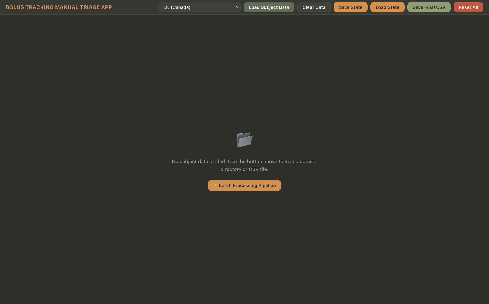

# Bolus Tracking Studio — Interface graphique Electron

> **L'interface graphique interactive principale pour le triage et le contrôle qualité des bolus.**



Construit sur Electron (Chromium) avec un moteur de rendu SVG en C++, le studio offre une interface multiplateforme à faible empreinte mémoire qui reproduit fidèlement le thème visuel Mid-Century Modern (MCM) de l'application native d'origine.

---

## Prérequis

| Dépendance | Version | Rôle |
|---|---|---|
| **Node.js** | ≥ 18.x | Environnement d'exécution Electron |
| **npm** | ≥ 9.x | Gestionnaire de paquets |
| **bolus_server** | (compilé) | Dorsal C++ pour le chargement TIFF, le calcul des traces, l'ajustement et le rendu SVG |

Le binaire `bolus_server` doit être compilé avant d'exécuter l'interface graphique :
```bash
cd .. && mkdir -p build && cd build
cmake .. && make bolus_server -j$(nproc)
```

## Installation

```bash
cd gui
npm install
```

## Exécution

```bash
npm start
```

Cette commande lance la fenêtre Electron avec un écran d'accueil (crescendo THX + animation vasculaire), puis présente l'espace de travail de triage.


## Pipeline de Traitement par Lots

**NOUVEAU :** Le studio intègre désormais un panneau de traitement par lots complet, remplaçant la nécessité d'utiliser `run_pipeline_cpp.sh` dans le terminal.
Caractéristiques :
- Sélectionnez le dossier d'un sujet via la boîte de dialogue native de fichiers
- Exécutez une **Analyse pré-vol** pour valider les fichiers MATLAB/TIFF sans les modifier
- Exécutez la **Préparation des fichiers** (Essai à blanc ou Appliquer) pour convertir les masques
- Exécutez le **Pipeline complet** avec la sortie du terminal en direct diffusée dans l'interface utilisateur
- Sortie avec code couleur (erreurs en rouge, avertissements en ambre, succès en vert)

---

## Architecture

```
gui/
├── main.js          # Processus principal Electron : lance bolus_server, pont IPC, gestion de fenêtre
├── preload.js       # contextBridge : API bolusAPI sécurisée exposée au moteur de rendu
├── renderer.js      # Logique d'interface : écran d'accueil, sons, pipeline IPC, gestion des ROI, localisation
├── index.html       # Mise en page complète : prévol, barre latérale, graphique SVG, paramètres, fenêtres modales
├── style.css        # Thème sombre MCM (correspondance exacte avec la palette ImGui)
├── package.json     # Dépendance Electron, paramètres mémoire, aucune bibliothèque Plotly/xterm
├── extract_locales.py  # Extraction des fichiers JSON de localisation depuis bolus_locale.cpp
├── locales/         # 44 fichiers JSON de localisation (104 à 114 clés chacun)
│   ├── en.json
│   ├── fr.json
│   ├── pirate.json
│   ├── yoda.json
│   └── ...
└── README_FR.md     # Ce fichier
```

### Protocole IPC

Le moteur de rendu communique avec `bolus_server` par JSON délimité par lignes via stdin/stdout :

```json
→ {"id":1, "action":"load_tiff", "params":{"path":"/data/subject-3554"}}
← {"id":1, "ok":true, "data":{"width":512, "height":512, "n_frames":600, "mip_base64":"..."}}
```

Commandes principales : `ping`, `load_tiff`, `load_rois`, `load_csv`, `compute_traces`, `get_trace`, `render_plot`, `auto_estimate`, `run_fit`, `save_csv`, `parse_framerate`, `convert_mat`.

### Rendu graphique

Tous les graphiques sont rendus en **C++** (et non en JavaScript). La commande `render_plot` retourne une chaîne SVG (~87 Ko) comportant :
- Un arrière-plan en charbon chaud correspondant au thème MCM
- Les points de données brutes (sarcelle), la courbe débruitée (dorée), l'ajustement gamma (vert sauge)
- Les axes, la grille, la légende et le titre de la ROI en orange brûlé

Aucune bibliothèque de visualisation JavaScript (Plotly.js, Chart.js, etc.) n'est utilisée.

---

## Thème MCM

La palette CSS est une conversion exacte, pixel par pixel, des valeurs `ImVec4` d'ImGui tirées de `bolus_gui.cpp` :

| Élément | Variable CSS | Hexadécimal | Source ImGui |
|---|---|---|---|
| Arrière-plan fenêtre | `--bg-primary` | `#2e2e2b` | `WindowBg: 0.18, 0.18, 0.17` |
| Arrière-plan panneau | `--bg-secondary` | `#383833` | `ChildBg: 0.22, 0.22, 0.20` |
| Champs de saisie | `--bg-elevated` | `#42403b` | `FrameBg: 0.26, 0.25, 0.23` |
| Texte principal | `--text-primary` | `#f2f0e6` | `Text: 0.95, 0.94, 0.90` |
| Texte estompé | `--text-muted` | `#99948c` | `TextDisabled: 0.60, 0.58, 0.55` |
| Boutons (sauge) | `--btn-sage` | `#616b59` | `Button: 0.38, 0.42, 0.35` |
| Accent (orange brûlé) | `--accent-burnt-orange` | `#E08C40` | `0.88, 0.55, 0.25` |
| Insigne CONFORME | `--color-pass` | `#8c9e73` | `0.55, 0.62, 0.45` |
| Insigne ALERTE | `--color-warn` | `#ebb84d` | `0.92, 0.72, 0.30` |
| Insigne ÉCHEC | `--color-fail` | `#cc5238` | `0.80, 0.32, 0.22` |
| Insigne RÉVISION | `--color-review` | `#5e8a8a` | `0.37, 0.54, 0.54` |

Police de caractères : **Outfit** (Google Fonts) — la même police géométrique sans empattement MCM que dans l'application native.

---

## Localisation

44 langues prises en charge (toutes issues de `bolus_locale.cpp`, à l'exclusion de l'égyptien ancien) :

**Langues réelles** : afrikaans, bengali, bulgare, catalan, chinois (simplifié), danois, néerlandais, anglais, espéranto, finnois, français, galicien, grec ancien, créole haïtien, hindi, indonésien, inuktitut, irlandais, italien, japonais, coréen, latin, norvégien, russe, scots, serbe, espagnol, suédois, tagalog, tamoul, thaï, turc, ukrainien, vietnamien.

**Langues de fantaisie** : Gen Alpha, Gen Z, klingon, Leet Speak, Minion, Pirate, shakespearien, Yoda.

Pour régénérer les fichiers de localisation à partir de la source C++ :
```bash
python3 extract_locales.py
```

---

## Contraintes de mémoire

- **Tas JavaScript** : Plafonné à 256 Mo via `--max-old-space-size=256` dans package.json
- **Images TIFF** : Libérées après le calcul des traces (récupération de 186 à 314 Mo)
- **Données MIP** : Transmises en base64 plutôt qu'en tableau JSON
- **Traces** : Récupérées une ROI à la fois via `get_trace`, sans sérialisation globale
- **Cible** : La mémoire totale (Electron + bolus_server) devrait rester sous 400 Mo

---

## Fichiers sonores

Les fichiers sonores suivants doivent être placés dans le répertoire `resources/` du projet :

| Fichier | Déclencheur |
|---|---|
| `thx_crescendo.wav` | Animation de l'écran d'accueil |
| `minion_squeak.wav` | Clics sur les boutons et interactions avec l'interface |
| `hallelujah.mp3` | Sauvegarde réussie du fichier CSV |

Les sons sont intégrés via `extraResources` dans package.json pour la portabilité.

---

## Avis de dépréciation

Cette interface graphique Electron remplace les deux anciennes interfaces :
1. **`python/src/bolus_gui.py`** (Python/tkinter/matplotlib) — légère mais lente, sans prise en charge multilingue
2. **`cpp/src/bolus_gui.cpp`** (C++/Dear ImGui/GLFW) — rapide mais nécessite des bibliothèques graphiques natives

Les anciens fichiers sont conservés à titre de référence mais ne doivent plus être utilisés pour de nouveaux travaux.
